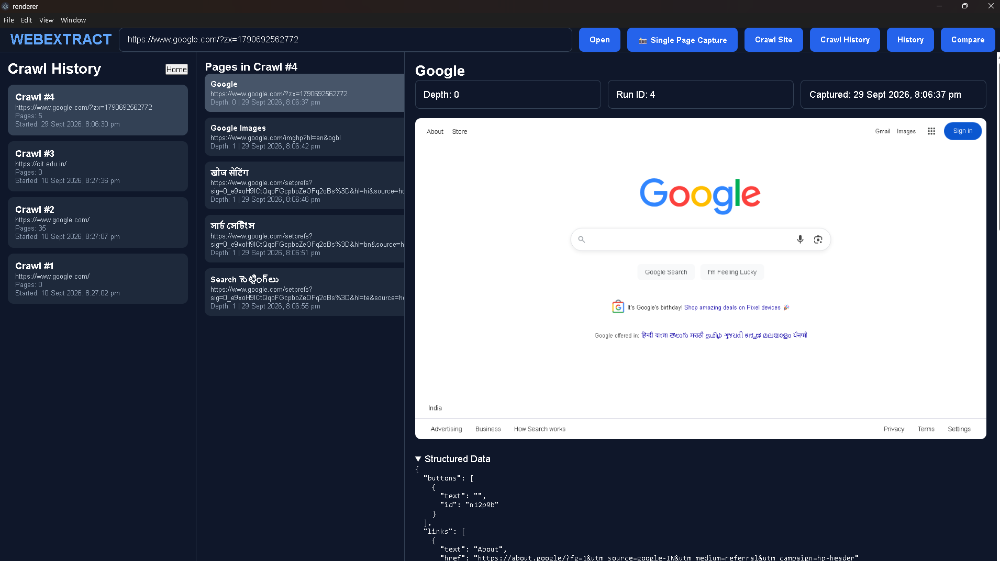

# WebExtract 🌐🔍

[](https://github.com/Sanjay17-cmd/WebExtract)
[](https://nodejs.org/)
[](https://www.electronjs.org/)
[](https://react.dev/)
[](https://vitejs.dev/)
[](https://playwright.dev/)
[](https://www.postgresql.org/)
[](LICENSE)

> **Repository:** [https://github.com/Sanjay17-cmd/WebExtract](https://github.com/Sanjay17-cmd/WebExtract)  
> **Author:** Sanjay ([@Sanjay17-cmd](https://github.com/Sanjay17-cmd))

---

## 📖 Table of Contents
1. [What is WebExtract Used For?](#-what-is-webextract-used-for)
2. [Key Features](#-key-features)
3. [System Architecture & Data Flow](#-system-architecture--data-flow)
   - [High-Level Architecture](#high-level-architecture)
   - [Data Flow: What Data is Transferred to Where?](#data-flow-what-data-is-transferred-to-where)
4. [Database Setup & SQL Scripts](#-database-setup--sql-scripts)
   - [Which SQL to Run Where?](#which-sql-to-run-where)
   - [Complete SQL Schema](#complete-sql-schema-schemasql)
5. [Installation & Getting Started](#-installation--getting-started)
   - [Prerequisites](#1-prerequisites)
   - [First-Time System Setup](#2-first-time-system-setup-step-by-step)
   - [Environment Configuration](#3-environment-configuration-optional)
6. [Commands for Regular Usage](#-commands-for-regular-usage)
7. [Screenshots & Visual Walkthrough](#-screenshots--visual-walkthrough)
   - [1. Front Page / Extraction Dashboard (2 Views)](#1-front-page--extraction-dashboard-2-views)
   - [2. Single History & Page Metrics (1 View)](#2-single-history--page-metrics-1-view)
   - [3. Version Comparison & Diff Engine (3 Views)](#3-version-comparison--diff-engine-3-views)
   - [4. Crawl History & Site Crawler (1 View)](#4-crawl-history--site-crawler-1-view)
   - [All Screenshots Quick Index](#all-screenshots-quick-index)
8. [Project File Structure](#-project-file-structure)
9. [Troubleshooting & FAQs](#-troubleshooting--faqs)

---

## 🎯 What is WebExtract Used For?

**WebExtract** is an advanced desktop web intelligence, forensic auditing, and automated visual regression platform built with **Electron**, **React 19 (Vite)**, **Playwright**, and **PostgreSQL**.

### The Problem It Solves:
Traditional headless scrapers and web crawlers (like standard curl, BeautifulSoup, Puppeteer, or basic Playwright scripts) face major bottlenecks:
- **Authentication & Login Walls**: They get immediately blocked by Cloudflare, CAPTCHAs, bot detectors, or complex SSO / 2FA login screens (e.g. LinkedIn, GitHub private dashboards, internal enterprise portals).
- **Dynamic Single Page Applications (SPAs)**: Content rendered client-side with React, Vue, or Angular often misses full DOM hydration in headless contexts.
- **Visual Drift & Regression Blind Spots**: Developers and QA engineers struggle to pinpoint exactly *what* changed between two deployments (whether DOM nodes were removed, layout shifted, buttons broke, or styling altered).

### How WebExtract Solves It:
WebExtract bridges **interactive human browsing** with **automated high-fidelity headless capture**:
1. **Live Authenticated Browsing**: You browse the web naturally in an embedded Electron `<webview>`. You can log into any website, navigate dynamic feeds, and bypass bot protections as a regular user.
2. **Session-Aware Playwright CDP Capture**: With one click, WebExtract exports live session cookies and DOM snapshots directly into Playwright via Chrome DevTools Protocol (`remote-debugging-port 9222`), producing a pixel-perfect, full-page scrolled capture without any desktop UI chrome.
3. **Deep Structural & Metric Mining**: Automatically parses DOM trees, counts and extracts buttons, hyperlinks, form inputs, data tables, headings, semantic sections, and network API activity.
4. **Autonomous Site Crawling**: Traverses entire websites recursively using a breadth-first queue with customizable depth limits, max-page quotas, request throttling, and external domain filters.
5. **Multi-Dimensional Version Comparison**: Compares two captures of the same URL across **5 distinct layers**:
   - 📊 **Metric Deltas** (DOM nodes, button counts, links, forms, tables, API calls)
   - 🧩 **Structural Element Diff** (JSON side-by-side added vs. removed elements)
   - 🖼️ **Side-by-Side Screenshots** (dual full-height image comparison)
   - 🔴🟢 **Pixel-by-Pixel Visual Heatmap** (powered by `pixelmatch` to spot visual regressions)
   - 💻 **Monaco HTML Source Code Diff** (syntax-highlighted code editor diff)

---

## ✨ Key Features

- 🌐 **Interactive Embedded Webview**: Browse any website live, interact with web apps, handle logins, and preview pages in real time.
- 📸 **Live Session Full-Page Screenshots**: Captures complete scrolled page heights with 100% session sharing and automated fallbacks (Playwright CDP $\rightarrow$ In-Session CDP $\rightarrow$ Native WebContents capture).
- 🌲 **Visual HTML Tree Viewer**: Inspect hierarchical DOM trees and interactive element mappings right in the sidebar.
- ⚡ **Real-Time Element Metrics**: Instant count of DOM nodes, buttons, links, forms, data tables, semantic sections, headings (H1–H6), and API requests.
- 📥 **Bulk URL Extraction**: Queue and extract multiple URLs sequentially with real-time status tracking.
- 🕷️ **Recursive Deep Web Crawler**:
  - Configurable `maxDepth` and `maxPages` limits.
  - Polite crawl delay (`delayMs`) to avoid rate limits.
  - Same-origin restriction (`allowExternal` toggle).
- 📜 **Historical Audit Log**: Every capture is indexed in PostgreSQL with timestamps, file references, and computed statistics.
- 🔍 **5-Layer Version Diffing Engine**:
  - Side-by-side metric comparison cards.
  - Granular added/removed element breakdown.
  - Dual screenshot visual comparator.
  - Automated `pixelmatch` visual difference image generation with changed pixel counter.
  - Side-by-side Monaco diff editor for HTML source changes.
- 🗄️ **Hybrid Storage Pipeline**: High-speed relational queries in PostgreSQL + localized raw disk storage (`data/`) for large artifacts (screenshots, HTML files, DOM ASTs, structured JSON).

---

## 🏛️ System Architecture & Data Flow

### High-Level Architecture

```
┌─────────────────────────────────────────────────────────────────────────────┐
│                          PRESENTATION LAYER (UI)                            │
│  React 19 + Vite (Port 5173)                                                │
│  ├── Embedded <webview> (Interactive live browsing)                         │
│  ├── Bulk URL Scraper & HTML Tree Viewer                                    │
│  ├── Single Page Capture & Real-time Metrics Dashboard                     │
│  ├── Crawl History & Site Crawler Modal                                    │
│  └── Compare Page (Monaco Diff Editor + Pixelmatch Heatmap Viewer)          │
└──────────────────────────────────────┬──────────────────────────────────────┘
                                       │ Electron IPC Bridge
                                       ▼ (contextIsolation & preload.js)
┌─────────────────────────────────────────────────────────────────────────────┐
│                        MAIN DESKTOP RUNTIME LAYER                           │
│  Electron 42 Main Process (Port 9222 Remote Debugging Enabled)              │
│  ├── electron/main.js       (Window lifecycle & CDP setup)                  │
│  ├── electron/ipc.js        (Capture handlers, history, visual diff)        │
│  └── electron/crawlIpc.js   (Crawler job manager & session recorder)       │
└──────────────────────┬───────────────────────────────┬──────────────────────┘
                       │                               │
       Session & DOM   │                               │ Session Cookies & DOM
       Extraction      ▼                               ▼ Snapshot Injection
┌──────────────────────────────┐              ┌───────────────────────────────┐
│     CAPTURE ENGINES          │              │        DIFF ENGINES           │
│  ├── capture/extractPageData │              │  ├── capture/visualDiff.js    │
│  │   (DOM AST, Forms, Links) │              │  │   (Pixelmatch diff image)  │
│  ├── capture/playwrightCdp   │              │  └── Monaco Editor            │
│  │   (Headless full-page)    │              │      (HTML side-by-side diff) │
│  └── capture/siteCrawler     │              └───────────────────────────────┘
│      (Recursive Playwright)  │
└──────────────┬───────────────┘
               │
               ▼
┌─────────────────────────────────────────────────────────────────────────────┐
│                          PERSISTENCE LAYER (HYBRID)                         │
│                                                                             │
│  📁 LOCAL FILESYSTEM (data/)               🗄️ POSTGRESQL DATABASE (5432)   │
│  ├── data/screenshots/*.png                ├── captures                     │
│  ├── data/html/*.html                      │   (metadata, metrics, paths)   │
│  ├── data/dom/*.json                       ├── crawl_runs                   │
│  ├── data/structured/*.json                │   (session run logs)           │
│  ├── data/crawl_* (crawler assets)         └── crawl_pages                  │
│  └── data/visualdiff/*.png (diff masks)        (page-level crawl records)   │
└─────────────────────────────────────────────────────────────────────────────┘
```

---

### Data Flow: What Data is Transferred to Where?

Here is the exact lifecycle of how data moves across the system:

```
[User Action: Click "Single Page Capture"]
       │
       ▼
1. Webview Script Execution (renderer/src/App.jsx)
   └── Executes in webview context: parses document.documentElement.outerHTML,
       computes DOM node tree (up to 400 nodes), counts buttons, links, forms,
       tables, headings, and collects API calls.
       │
       ▼
2. IPC Event Transfer: `save-capture` (renderer -> electron/ipc.js)
   └── Passes { url, title, html, domNodes, buttons, links, forms, tables,
                headings, sections, apiCalls, webContentsId, metrics }.
       │
       ▼
3. Session Extraction & Headless Render (capture/playwrightCdpCapture.js)
   └── Electron Main extracts active session cookies from the webview.
   └── Playwright spawns headless Chromium, applies cookies, mocks root route,
       injects sanitized HTML snapshot, sets <base href>, eagerly decodes images,
       and renders the full-page screenshot.
       │
       ▼
4. Raw Asset Persistence (Local Filesystem -> data/)
   ├── Screenshot (.png)    --> data/screenshots/{timestamp}.png
   ├── Raw HTML (.html)     --> data/html/{timestamp}.html
   ├── DOM Tree (.json)     --> data/dom/{timestamp}.json
   └── Structured (.json)   --> data/structured/{timestamp}.json
       │
       ▼
5. Relational Metadata Persistence (PostgreSQL -> `captures` table)
   └── Stores URL, Title, Timestamp, File Paths, and Counts (Buttons, Links,
       Forms, Tables, Sections, Headings, API count, DOM nodes, Load Time).
       │
       ▼
6. Version Comparison Data Flow (renderer/src/ComparePage.jsx)
   └── User selects Version A and Version B.
   └── IPC `get-capture-details` fetches records + reads HTML/DOM from disk.
   └── IPC `generate-visual-diff` reads screenshots A & B, executes `pixelmatch`,
       generates heatmap image to `data/visualdiff/{idA}_{idB}.png`.
   └── React renders side-by-side screenshots, Monaco HTML diff, and metric deltas.
```

---

## 🗄️ Database Setup & SQL Scripts

### Which SQL to Run Where?

WebExtract provides two convenient ways to set up the database:

#### Method 1: Automatic Initialization (Zero Manual Work)
The application has built-in schema initialization! When you run `npm run dev`, Electron connects to PostgreSQL and automatically calls `initDatabase()` from `storage/postgres.js`.  
It creates all required tables and missing columns if they do not exist already.

#### Method 2: Manual Execution via PostgreSQL Client (Recommended for Custom Setups)
If you prefer running the schema manually or verifying your database schema beforehand:

| Tool | Where & How to Run |
|---|---|
| **psql (Command Line)** | Open your terminal in the project directory and run:<br>`psql -U postgres -d postgres -f schema.sql` |
| **pgAdmin 4 (GUI)** | 1. Open pgAdmin and connect to your server.<br>2. Select database **`postgres`** (or your target DB).<br>3. Open **Tools** $\rightarrow$ **Query Tool**.<br>4. Open or paste `schema.sql` and press **F5 (Execute)**. |
| **DBeaver / DataGrip** | Open a new SQL console connected to your PostgreSQL database, paste the contents of `schema.sql`, and run the script. |

---

### Complete SQL Schema (`schema.sql`)

The database consists of 3 relational tables:
1. `captures`: Stores individual page captures, metrics, and file paths.
2. `crawl_runs`: Stores website crawler sessions and run-level metadata.
3. `crawl_pages`: Stores individual pages gathered during a crawl run with foreign key cascade to `crawl_runs`.

```sql
-- ============================================================
-- PostgreSQL Schema for WebExtract Application
-- File: schema.sql
-- ============================================================

-- 1. Captures Table (stores individual page captures and metadata)
CREATE TABLE IF NOT EXISTS captures (
    id SERIAL PRIMARY KEY,
    url TEXT,
    title TEXT,
    captured_at TIMESTAMPTZ DEFAULT NOW(),
    screenshot_path TEXT,
    html_path TEXT,
    dom_path TEXT,
    structured_data_path TEXT,
    load_time_ms INTEGER DEFAULT 0,
    dom_nodes INTEGER DEFAULT 0,
    buttons_count INTEGER DEFAULT 0,
    links_count INTEGER DEFAULT 0,
    forms_count INTEGER DEFAULT 0,
    tables_count INTEGER DEFAULT 0,
    sections_count INTEGER DEFAULT 0,
    headings_count INTEGER DEFAULT 0,
    api_count INTEGER DEFAULT 0
);

-- 2. Crawl Runs Table (stores website crawling sessions)
CREATE TABLE IF NOT EXISTS crawl_runs (
    id SERIAL PRIMARY KEY,
    root_url TEXT,
    started_at TIMESTAMPTZ DEFAULT NOW(),
    finished_at TIMESTAMPTZ,
    total_pages INTEGER DEFAULT 0
);

-- 3. Crawled Pages Table (stores individual pages collected during a crawl run)
CREATE TABLE IF NOT EXISTS crawl_pages (
    id SERIAL PRIMARY KEY,
    crawl_run_id INTEGER REFERENCES crawl_runs(id) ON DELETE CASCADE,
    url TEXT,
    title TEXT,
    depth INTEGER,
    captured_at TIMESTAMPTZ DEFAULT NOW(),
    screenshot_path TEXT,
    html_path TEXT,
    dom_path TEXT,
    structured_data_path TEXT
);
```

---

## 🛠️ Installation & Getting Started

### 1. Prerequisites

Before installing the application, ensure the following software is installed on your system:

| Software | Minimum Version | Download Link |
|---|---|---|
| **Node.js** | v18.x or v20.x+ | [nodejs.org](https://nodejs.org/) |
| **npm** | v9.x or v10.x+ | Included with Node.js |
| **PostgreSQL** | v12.x or later | [postgresql.org/download](https://www.postgresql.org/download/) |
| **Git** | Any modern version | [git-scm.com](https://git-scm.com/) |

---

### 2. First-Time System Setup (Step-by-Step)

Follow these exact commands in your terminal or PowerShell:

#### Step 1: Clone the Repository
```bash
git clone https://github.com/Sanjay17-cmd/WebExtract.git
cd WebExtract
```

#### Step 2: Install Root Dependencies
Installs Electron, Playwright, pg, pixelmatch, and build tools:
```bash
npm install
```

#### Step 3: Install Frontend Renderer Dependencies
Installs React 19, Monaco Editor, and Vite dependencies:
```bash
cd renderer
npm install
cd ..
```

#### Step 4: Install Playwright Chromium Browser Binaries
Playwright needs Chromium browser binaries installed to perform headless session-state screenshot rendering and crawling:
```bash
npx playwright install chromium
```

#### Step 5: Verify or Run the Database Schema
Ensure your PostgreSQL service is running.  
- Default user: `postgres`
- Default password: `root`
- Default port: `5432`
- Default database: `postgres`

Run the schema script (or let the app auto-create it on first launch):
```bash
psql -U postgres -d postgres -f schema.sql
```

---

### 3. Environment Configuration (Optional)

By default, WebExtract connects with `postgres:root@localhost:5432/postgres`.  
If your PostgreSQL credentials differ, you can set standard environment variables or create a `.env` file (see `.env.example`):

```bash
# Windows PowerShell
$env:PGUSER="postgres"
$env:PGPASSWORD="your_password"
$env:PGHOST="localhost"
$env:PGPORT="5432"
$env:PGDATABASE="postgres"
```

```bash
# Linux / macOS / Git Bash
export PGUSER="postgres"
export PGPASSWORD="your_password"
export PGHOST="localhost"
export PGPORT="5432"
export PGDATABASE="postgres"
```

---

## 🚀 Commands for Regular Usage

### Starting the Development App (One Command)
To run the React frontend and Electron desktop app concurrently:

```bash
npm run dev
```

> **What this does:**
> 1. Starts the Vite dev server for the React UI at `http://localhost:5173`.
> 2. Uses `wait-on` to wait until the server responds.
> 3. Launches Electron connecting to `http://localhost:5173` with Chrome DevTools Protocol enabled on port `9222`.

---

### Running Individual Services Separately (Optional)

If you wish to run the Vite dev server and Electron in separate terminals:

```bash
# Terminal 1: Run Vite React frontend
npm run react
# (Equivalent to: npm run dev --prefix renderer)

# Terminal 2: Run Electron main process
npm run electron
# (Waits for localhost:5173 then launches Electron)
```

---

### Building the Frontend for Production

To test or generate optimized production assets for the renderer:

```bash
npm run build --prefix renderer
```

---

## 📸 Screenshots & Visual Walkthrough

> Below are the application screenshots organized by view. Each slot includes the embedded preview and commented code blocks so you can easily rearrange, replace, or update your screenshots anytime!

---

### 1. Front Page / Extraction Dashboard (2 Views)

The **Front Page** provides an interactive web browsing environment with URL navigation, a Bulk URL capture drawer, real-time HTML node tree inspection, and live element counters.

#### Front Page — View 1: Live Interactive Webview & Element Inspector
<p align="center">
  
</p>

<!-- ================================================================= -->
<!-- SCREENSHOT CODE BLOCK: Front Page (View 1)                        -->
<!-- File: readme_screenshots/Screenshot 2026-09-29 200014.png         -->
<!-- ================================================================= -->

<br/>

#### Front Page — View 2: Capture Actions & Bulk Scraper View
<!-- ================================================================= -->
<!-- SCREENSHOT SLOT: Front Page (View 2)                              -->
<!-- Drop your second front-page screenshot below:                     -->
<!-- ================================================================= -->
<p align="center">
  
</p>
<sub><em>💡 Note: Replace the image source above with your second front page screenshot if you have a distinct secondary view.</em></sub>

---

### 2. Single History & Page Metrics (1 View)

The **History Page** displays past captures, timestamped audit entries, extracted structural counters (Buttons, Links, Forms, Tables, Sections, Headings, API calls, DOM nodes), and high-resolution full-page screenshot previews.

#### History View — Extracted Metadata & Full-Page Screenshot Audit
<p align="center">
  
</p>

<!-- ================================================================= -->
<!-- SCREENSHOT CODE BLOCK: Single History View                        -->
<!-- File: readme_screenshots/Screenshot 2026-09-29 200025.png         -->
<!-- ================================================================= -->

---

### 3. Version Comparison & Diff Engine (3 Views)

WebExtract provides an unprecedented multi-layer regression testing tool between any two saved captures of the same URL.

#### Comparison View 1 — Summary Metric Deltas & Added/Removed Element Diff
Displays numerical diff cards (Load Time, DOM Nodes, Buttons, Links, Forms, Tables, Sections, Headings, API calls) alongside side-by-side JSON diffs of added and removed elements.

<p align="center">
  
</p>

<!-- ================================================================= -->
<!-- SCREENSHOT CODE BLOCK: Compare Versions - Metrics & Element Diff  -->
<!-- File: readme_screenshots/Screenshot 2026-09-29 200032.png         -->
<!-- ================================================================= -->

<br/>

#### Comparison View 2 — Synchronized Side-by-Side Visual Screenshot Comparison
Visually compares Version A against Version B in full resolution side by side.

<p align="center">
  
</p>

<!-- ================================================================= -->
<!-- SCREENSHOT CODE BLOCK: Compare Versions - Side-by-Side Screenshots -->
<!-- File: readme_screenshots/Screenshot 2026-09-29 200041.png         -->
<!-- ================================================================= -->

<br/>

#### Comparison View 3 — Pixelmatch Visual Heatmap Diff & Monaco HTML Source Diff
Displays the pixel-level difference heatmap generated via `pixelmatch` (highlighting altered pixels in red/green) and Monaco Editor's side-by-side syntax-highlighted HTML diff.

<p align="center">
  
</p>

<!-- ================================================================= -->
<!-- SCREENSHOT CODE BLOCK: Compare Versions - Pixelmatch Diff Heatmap -->
<!-- File: readme_screenshots/Screenshot 2026-09-29 200049.png         -->
<!-- ================================================================= -->

<br/>

<p align="center">
  
</p>

<!-- ================================================================= -->
<!-- SCREENSHOT CODE BLOCK: Compare Versions - Monaco Source Diff      -->
<!-- File: readme_screenshots/Screenshot 2026-09-29 200057.png         -->
<!-- ================================================================= -->

<br/>

<p align="center">
  
</p>

<!-- ================================================================= -->
<!-- SCREENSHOT CODE BLOCK: Compare Versions - Version Dropdown        -->
<!-- File: readme_screenshots/Screenshot 2026-09-29 200112.png         -->
<!-- ================================================================= -->

---

### 4. Crawl History & Site Crawler (1 View)

The **Crawl History** view monitors recursive crawling jobs, displaying root URLs, start/finish timestamps, total pages visited, and page-by-page deep extraction hierarchies.

#### Crawl History — Crawl Run Audit & Hierarchical Page Tree
<!-- ================================================================= -->
<!-- SCREENSHOT SLOT: Crawl History View                               -->
<!-- Add your Crawl History screenshot file into readme_screenshots/   -->
<!-- and reference it below:                                           -->
<!-- ================================================================= -->
<p align="center">
  
</p>
<sub><em>💡 Note: Place your crawl history image into `readme_screenshots/crawl_history_screenshot.png` (or update the filename in the tag above).</em></sub>

---

### All Screenshots Quick Index

| Section | Image File | Description |
|---|---|---|
| **Front Page (1/2)** | `readme_screenshots/Screenshot 2026-09-29 200014.png` | Main Dashboard: Active Webview, Bulk URL Drawer, HTML Tree |
| **Front Page (2/2)** | *Placeholder / Custom* | Secondary Dashboard view / Capture in action |
| **Single History** | `readme_screenshots/Screenshot 2026-09-29 200025.png` | Capture Audit: YouTube metrics, element counts, screenshot preview |
| **Compare Versions (1/3)** | `readme_screenshots/Screenshot 2026-09-29 200032.png` | Comparison: Metric difference cards and JSON element deltas |
| **Compare Versions (2/3)** | `readme_screenshots/Screenshot 2026-09-29 200041.png` | Comparison: Side-by-side full page screenshot comparator |
| **Compare Versions (3/3)** | `readme_screenshots/Screenshot 2026-09-29 200049.png` | Comparison: Pixelmatch visual difference heatmap |
| **Compare Source Diff** | `readme_screenshots/Screenshot 2026-09-29 200057.png` | Comparison: Monaco side-by-side HTML source code diff editor |
| **Version Selector** | `readme_screenshots/Screenshot 2026-09-29 200112.png` | Comparison: Version selection dropdown menu |
| **Crawl History** | *Placeholder / Custom* | Crawl run session list and crawled page tree |

---

## 📂 Project File Structure

```
WebExtract/
├── capture/                          # Extraction, crawling & diff engines
│   ├── electronCapture.js            # In-session WebContents CDP screenshot capture
│   ├── extractPageData.js            # DOM AST & structured element extractor
│   ├── playwrightCdpCapture.js       # Session-state Playwright CDP full-page capture
│   ├── saveCrawlerCapture.js         # Persists individual crawled page records to Postgres
│   ├── sessionExport.js              # Extracts active session cookies & storage
│   ├── siteCrawler.js                # Recursive breadth-first Playwright crawler
│   └── visualDiff.js                 # Pixelmatch visual screenshot diff generator
│
├── electron/                         # Electron main process & IPC handlers
│   ├── crawlIpc.js                   # IPC handlers for crawler execution & crawl history
│   ├── ipc.js                        # IPC handlers for capture, history, and visual diff
│   ├── main.js                       # BrowserWindow lifecycle & remote debugging port
│   └── preload.js                    # Secure contextBridge API for the renderer
│
├── storage/                          # PostgreSQL database connection & schema
│   └── postgres.js                   # Connection pool & automatic table initialization
│
├── renderer/                         # React 19 + Vite frontend application
│   ├── index.html                    # HTML application entry point
│   ├── package.json                  # Frontend dependencies & scripts
│   ├── vite.config.js                # Vite build & plugin configuration
│   ├── public/                       # Static public assets (icons, SVGs)
│   └── src/                          # React components & application pages
│       ├── main.jsx                  # React application mount
│       ├── App.jsx                   # Main layout, webview, bulk URL & tree viewer
│       ├── App.css                   # Global styles & dark modern theme
│       ├── captureStorage.js         # Client-side capture dispatch helper
│       ├── formatters.js             # Date and file:// URL normalizers
│       ├── HistoryPage.jsx           # Single capture history & metric audit viewer
│       ├── CrawlHistoryPage.jsx      # Crawl run sessions & page hierarchy viewer
│       ├── ComparePage.jsx           # Version comparison, visual & source diffing
│       └── HtmlDiffViewer.jsx        # Monaco Editor side-by-side diff component
│
├── readme_screenshots/               # Project screenshots for documentation & GitHub
│   ├── Screenshot 2026-09-29 200014.png
│   ├── Screenshot 2026-09-29 200025.png
│   ├── Screenshot 2026-09-29 200032.png
│   ├── Screenshot 2026-09-29 200041.png
│   ├── Screenshot 2026-09-29 200049.png
│   ├── Screenshot 2026-09-29 200057.png
│   └── Screenshot 2026-09-29 200112.png
│
├── data/                             # Runtime persistence directory (generated at runtime)
│   ├── screenshots/                  # Single page screenshots (.png)
│   ├── html/                         # Raw HTML snapshots (.html)
│   ├── dom/                          # Serialized DOM trees (.json)
│   ├── structured/                   # Extracted elements (.json)
│   ├── crawl_screenshots/            # Crawler screenshots (.png)
│   ├── crawl_html/                   # Crawler HTML snapshots (.html)
│   ├── crawl_dom/                    # Crawler DOM trees (.json)
│   ├── crawl_structured/             # Crawler structured elements (.json)
│   └── visualdiff/                   # Pixelmatch visual diff images (.png)
│
├── .env.example                      # PostgreSQL configuration template
├── .gitignore                        # Git exclusion rules
├── package.json                      # Root configuration, Electron & concurrently scripts
├── schema.sql                        # PostgreSQL relational schema for manual execution
└── README.md                         # Comprehensive project documentation
```

---

## ❓ Troubleshooting & FAQs

### 1. PostgreSQL Connection Error (`ECONNREFUSED 127.0.0.1:5432`)
- **Cause:** PostgreSQL service is stopped or running on a different port.
- **Solution:**
  - On Windows: Open `services.msc`, locate **postgresql-x64-XX**, and click **Start**.
  - Check your password in `storage/postgres.js` or set the `PGPASSWORD` environment variable.
  - Verify you can log in via `psql -U postgres`.

### 2. Playwright Executable Error (`Executable doesn't exist at ...`)
- **Cause:** Playwright browser binaries have not been downloaded yet.
- **Solution:** Run the following command in the project root:
  ```bash
  npx playwright install chromium
  ```

### 3. Port Conflict on 5173
- **Cause:** Another process or Vite dev server is already running on port 5173.
- **Solution:** Terminate existing Node processes or specify a free port in `renderer/vite.config.js`.

### 4. Authenticated Sessions / Login Wall Captures
- **Tip:** WebExtract automatically exports active cookies from the embedded webview when taking full-page captures. Simply log into the website inside the webview first, then click **Single Page Capture** to capture the private session.

---

<p align="center">
  <b>Built with ❤️ by <a href="https://github.com/Sanjay17-cmd">Sanjay</a></b><br/>
  Star ⭐ the repository on <a href="https://github.com/Sanjay17-cmd/WebExtract">GitHub</a> if you found this project helpful!
</p>
